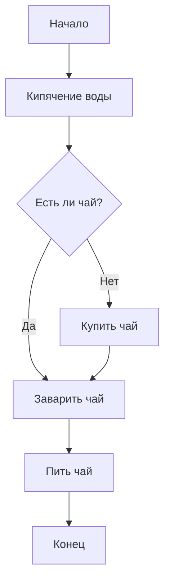
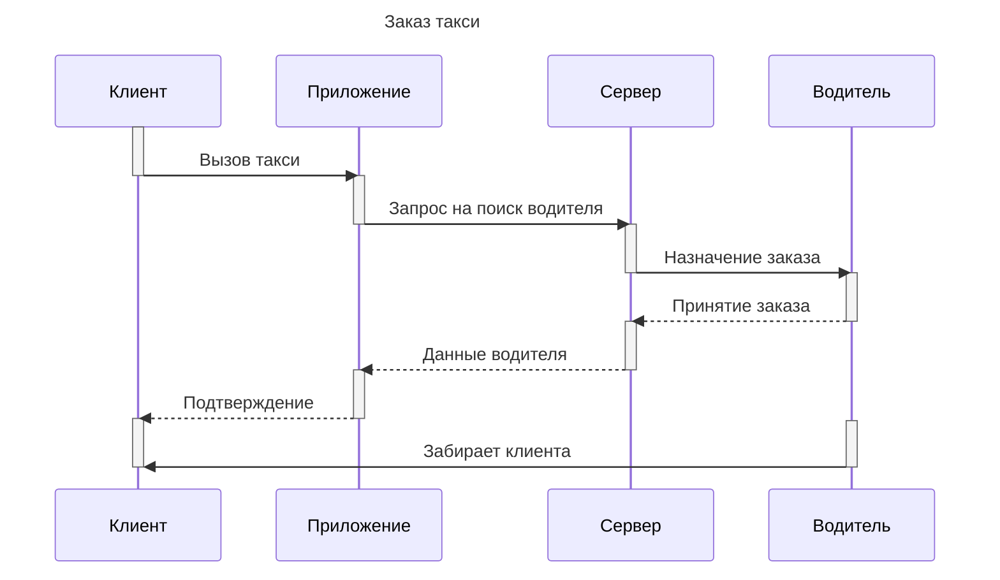
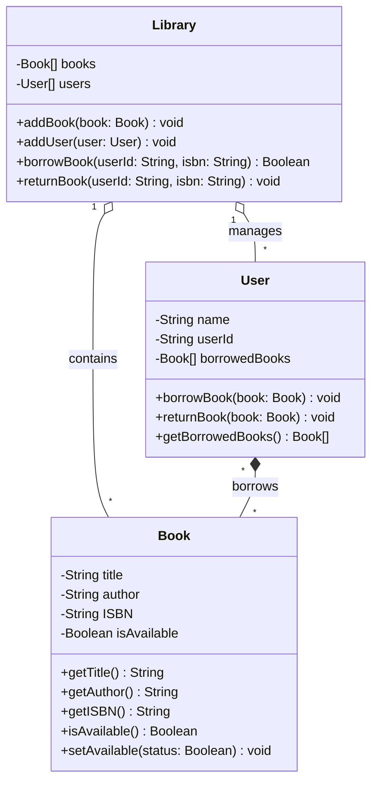
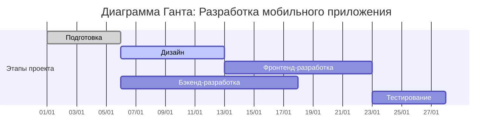

# zadania-dann
задание 1.1

```mermaid
graph TD
    A[Начало] --> B[Кипячение воды]
    B --> C{Есть ли чай?}
    C -->|Да| D[Заварить чай]
    C -->|Нет| E[Купить чай]
    E --> D
    D --> F[Пить чай]
    F --> G[Конец]
```
задание 1.2

```mermaid
sequenceDiagram
    title Заказ такси
    
    participant Клиент
    participant Приложение
    participant Сервер
    participant Водитель

    activate Клиент
    Клиент->>Приложение: Вызов такси
    deactivate Клиент

    activate Приложение
    Приложение->>Сервер: Запрос на поиск водителя
    deactivate Приложение

    activate Сервер
    Сервер->>Водитель: Назначение заказа
    deactivate Сервер

    activate Водитель
    Водитель-->>Сервер: Принятие заказа
    deactivate Водитель

    activate Сервер
    Сервер-->>Приложение: Данные водителя
    deactivate Сервер

    activate Приложение
    Приложение-->>Клиент: Подтверждение
    deactivate Приложение

    activate Клиент
    activate Водитель
    Водитель->>Клиент: Забирает клиента
    deactivate Водитель
    deactivate Клиент
```
задание 2.1

```mermaid
classDiagram
    class Library {
        -Book[] books
        -User[] users
        +addBook(book: Book) void
        +addUser(user: User) void
        +borrowBook(userId: String, isbn: String) Boolean
        +returnBook(userId: String, isbn: String) void
    }
    
    class User {
        -String name
        -String userId
        -Book[] borrowedBooks
        +borrowBook(book: Book) void
        +returnBook(book: Book) void
        +getBorrowedBooks() Book[]
    }
    
    class Book {
        -String title
        -String author
        -String ISBN
        -Boolean isAvailable
        +getTitle() String
        +getAuthor() String
        +getISBN() String
        +isAvailable() Boolean
        +setAvailable(status: Boolean) void
    }
    
    Library "1" o-- "*" Book : contains
    Library "1" o-- "*" User : manages
    User "*" *-- "*" Book : borrows
```
задание 2.2

```mermaid
gantt
    title Диаграмма Ганта: Разработка мобильного приложения
    dateFormat  YYYY-MM-DD
    axisFormat  %d/%m
    
    section Этапы проекта
    Подготовка           :done,    prep, 2024-01-01, 5d
    Дизайн              :active,  design, after prep, 7d
    Фронтенд-разработка :         frontend, after design, 10d
    Бэкенд-разработка   :         backend, after prep, 12d
    Тестирование        :         testing, after frontend, 5d
```