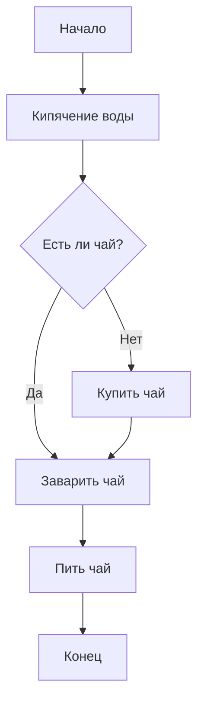
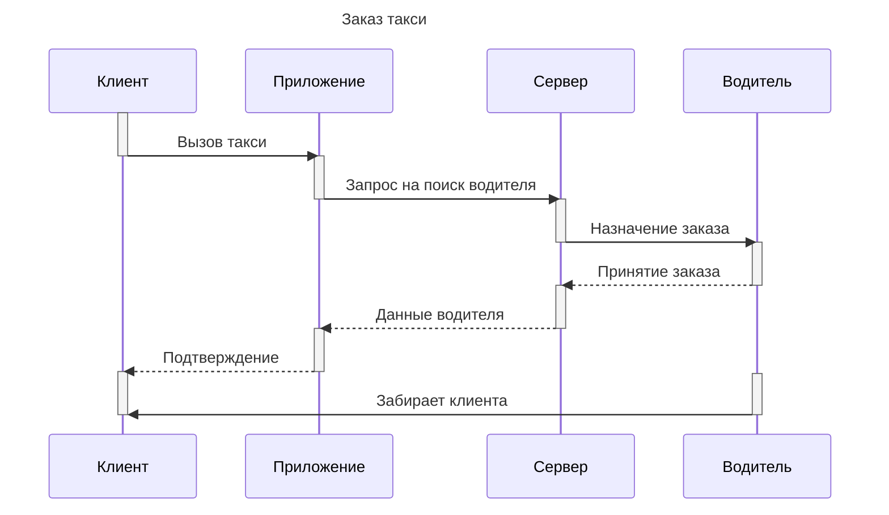
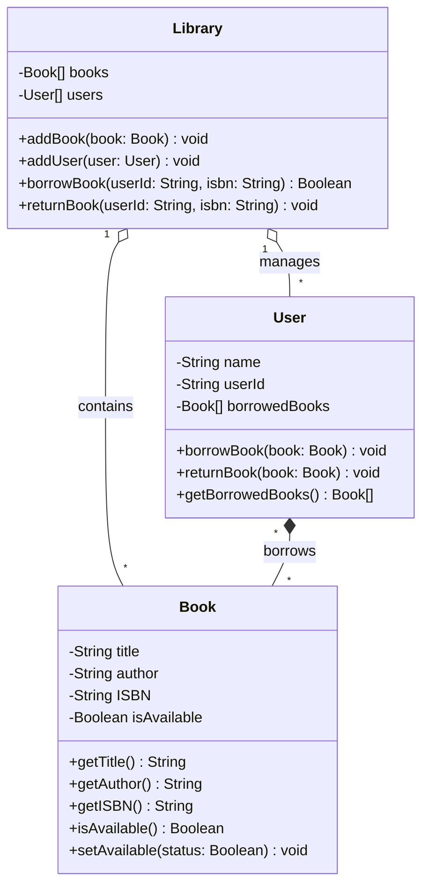
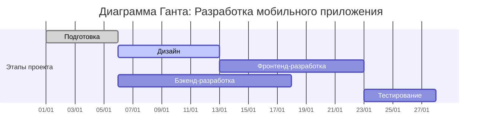
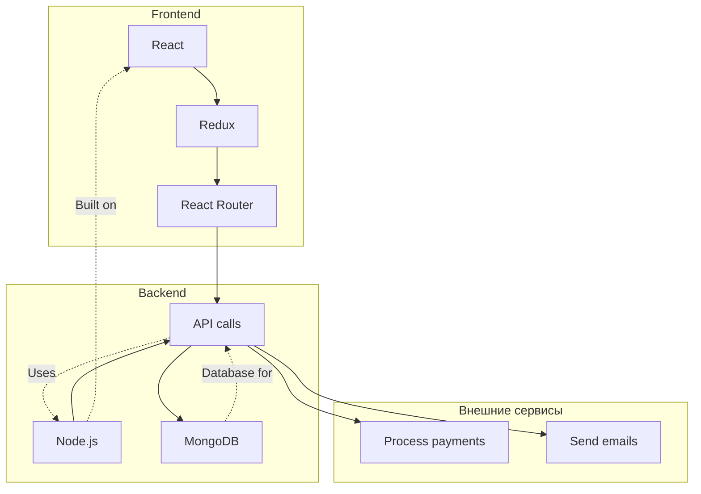
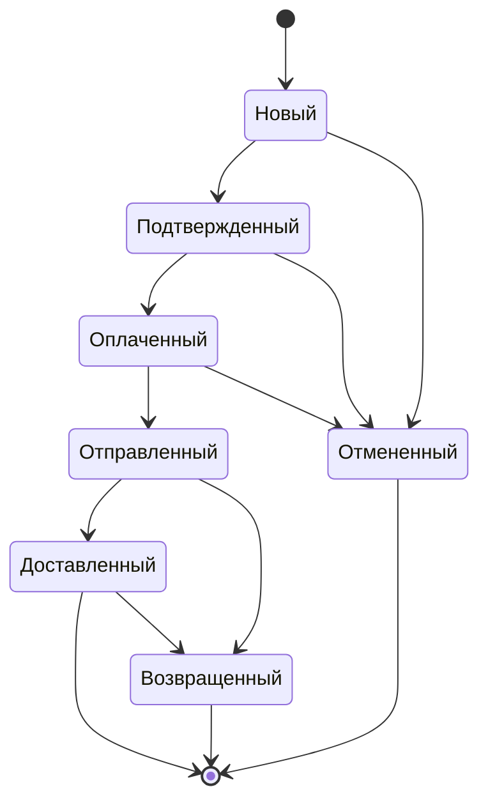
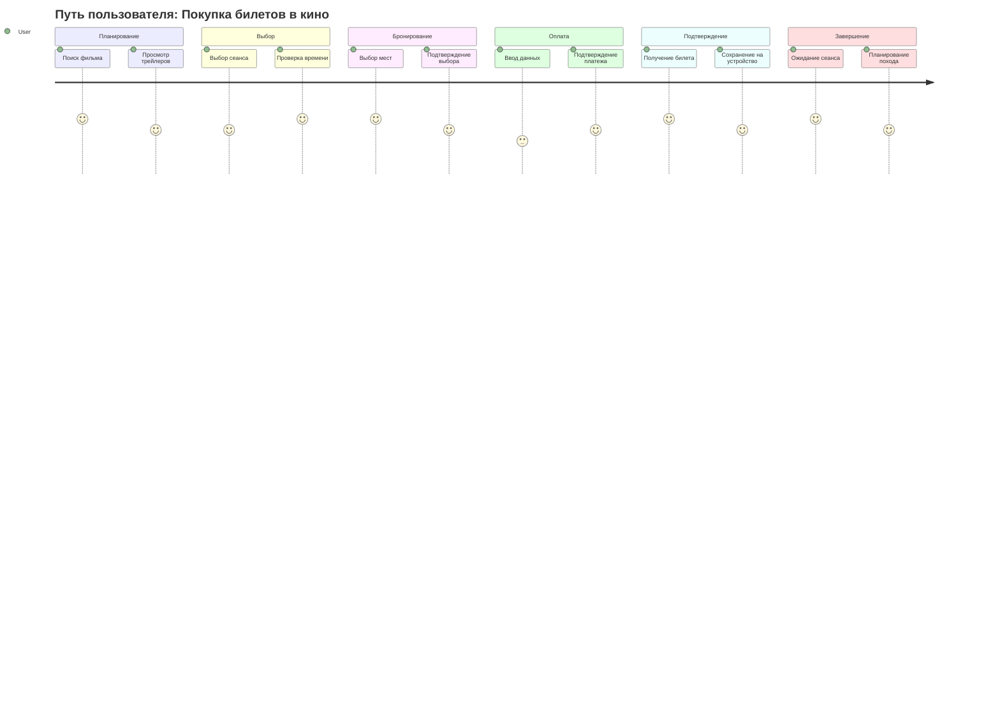
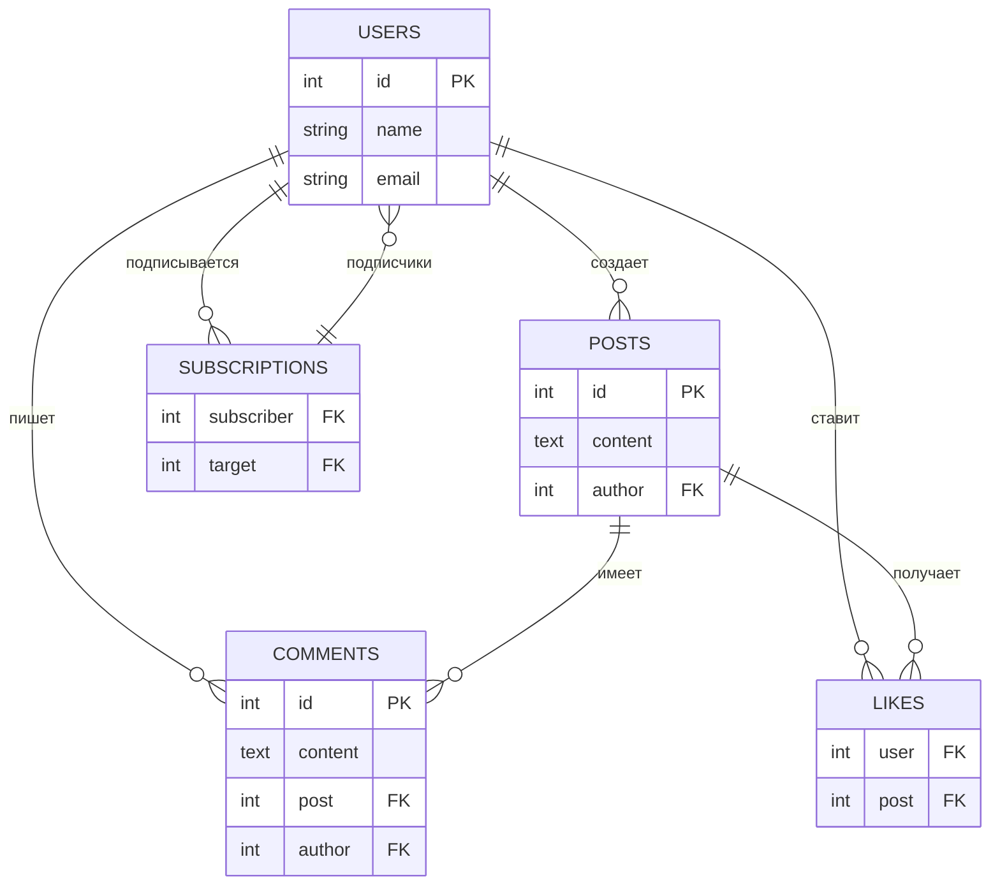
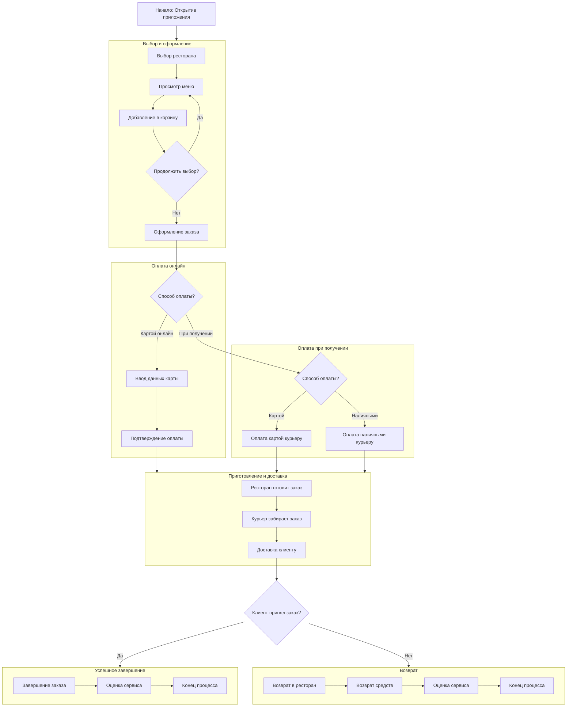
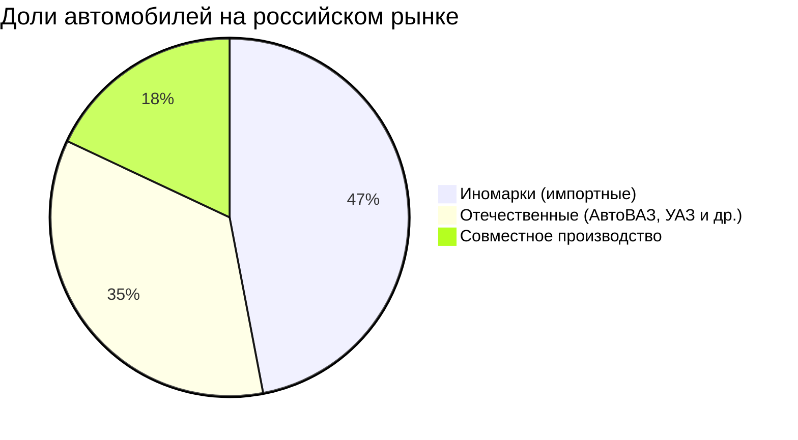

# zadania-dann
задание 1.1

```mermaid
graph TD
    A[Начало] --> B[Кипячение воды]
    B --> C{Есть ли чай?}
    C -->|Да| D[Заварить чай]
    C -->|Нет| E[Купить чай]
    E --> D
    D --> F[Пить чай]
    F --> G[Конец]
```
задание 1.2

```mermaid
sequenceDiagram
    title Заказ такси
    
    participant Клиент
    participant Приложение
    participant Сервер
    participant Водитель

    activate Клиент
    Клиент->>Приложение: Вызов такси
    deactivate Клиент

    activate Приложение
    Приложение->>Сервер: Запрос на поиск водителя
    deactivate Приложение

    activate Сервер
    Сервер->>Водитель: Назначение заказа
    deactivate Сервер

    activate Водитель
    Водитель-->>Сервер: Принятие заказа
    deactivate Водитель

    activate Сервер
    Сервер-->>Приложение: Данные водителя
    deactivate Сервер

    activate Приложение
    Приложение-->>Клиент: Подтверждение
    deactivate Приложение

    activate Клиент
    activate Водитель
    Водитель->>Клиент: Забирает клиента
    deactivate Водитель
    deactivate Клиент
```
задание 2.1

```mermaid
classDiagram
    class Library {
        -Book[] books
        -User[] users
        +addBook(book: Book) void
        +addUser(user: User) void
        +borrowBook(userId: String, isbn: String) Boolean
        +returnBook(userId: String, isbn: String) void
    }
    
    class User {
        -String name
        -String userId
        -Book[] borrowedBooks
        +borrowBook(book: Book) void
        +returnBook(book: Book) void
        +getBorrowedBooks() Book[]
    }
    
    class Book {
        -String title
        -String author
        -String ISBN
        -Boolean isAvailable
        +getTitle() String
        +getAuthor() String
        +getISBN() String
        +isAvailable() Boolean
        +setAvailable(status: Boolean) void
    }
    
    Library "1" o-- "*" Book : contains
    Library "1" o-- "*" User : manages
    User "*" *-- "*" Book : borrows
```
задание 2.2

```mermaid
gantt
    title Диаграмма Ганта: Разработка мобильного приложения
    dateFormat  YYYY-MM-DD
    axisFormat  %d/%m
    
    section Этапы проекта
    Подготовка           :done,    prep, 2024-01-01, 5d
    Дизайн              :active,  design, after prep, 7d
    Фронтенд-разработка :         frontend, after design, 10d
    Бэкенд-разработка   :         backend, after prep, 12d
    Тестирование        :         testing, after frontend, 5d
```
задание 3.1

```mermaid
graph TD
    subgraph Frontend
        A[React]
        B[Redux]
        C[React Router]
    end
    
    subgraph Backend
        D[Node.js]
        E[Express]
        F[MongoDB]
    end
    
    subgraph External_Services[Внешние сервисы]
        G[Stripe<br/>Платежи]
        H[SendGrid<br/>Email]
    end
    
    %% Связи внутри Frontend
    A --> B
    B --> C
    
    %% Связи внутри Backend
    D --> E
    E --> F
    
    %% Связи между Frontend и Backend
    C --> E[API calls]
    
    %% Связи Backend с внешними сервисами
    E --> G[Process payments]
    E --> H[Send emails]
    
    %% Связи зависимостей
    D -.->|Built on| A
    E -.->|Uses| D
    F -.->|Database for| E
```
задание 3.2

```mermaid
stateDiagram-v2
    [*] --> Новый
    Новый --> Подтвержденный
    Подтвержденный --> Оплаченный
    Оплаченный --> Отправленный
    Отправленный --> Доставленный
    Доставленный --> [*]
    
    Новый --> Отмененный
    Подтвержденный --> Отмененный
    Оплаченный --> Отмененный
    Отправленный --> Возвращенный
    Доставленный --> Возвращенный
    Возвращенный --> [*]
    Отмененный --> [*]
```
задание 4.1

```mermaid
journey
    title Путь пользователя: Покупка билетов в кино
    
    section Планирование
      Поиск фильма: 5: User
      Просмотр трейлеров: 4: User
    
    section Выбор  
      Выбор сеанса: 4: User
      Проверка времени: 5: User
    
    section Бронирование
      Выбор мест: 5: User
      Подтверждение выбора: 4: User
    
    section Оплата
      Ввод данных: 3: User
      Подтверждение платежа: 4: User
    
    section Подтверждение
      Получение билета: 5: User
      Сохранение на устройство: 4: User
    
    section Завершение
      Ожидание сеанса: 5: User
      Планирование похода: 4: User
```
задание 4.2

```mermaid
erDiagram
    USERS {
        int id PK
        string name
        string email
    }
    
    POSTS {
        int id PK
        text content
        int author FK
    }
    
    COMMENTS {
        int id PK
        text content
        int post FK
        int author FK
    }
    
    LIKES {
        int user FK
        int post FK
    }
    
    SUBSCRIPTIONS {
        int subscriber FK
        int target FK
    }
    
    USERS ||--o{ POSTS : "создает"
    USERS ||--o{ COMMENTS : "пишет"
    POSTS ||--o{ COMMENTS : "имеет"
    USERS ||--o{ LIKES : "ставит"
    POSTS ||--o{ LIKES : "получает"
    USERS ||--o{ SUBSCRIPTIONS : "подписывается"
    USERS }o--|| SUBSCRIPTIONS : "подписчики"
```
задание 5.1

```mermaid
flowchart TD
    Start[ Начало: Открытие приложения] --> A
    
    subgraph A[Выбор и оформление]
        A1[Выбор ресторана] --> A2[Просмотр меню]
        A2 --> A3[Добавление в корзину]
        A3 --> A4{Продолжить выбор?}
        A4 -- Да --> A2
        A4 -- Нет --> A5[Оформление заказа]
    end
    
    A5 --> B{Способ оплаты?}
    
    subgraph B1[Оплата онлайн]
        B -- Картой онлайн --> B11[Ввод данных карты]
        B11 --> B12[Подтверждение оплаты]
    end
    
    subgraph B2[Оплата при получении]
        B -- При получении --> B21{Способ оплаты?}
        B21 -- Картой --> B22[Оплата картой курьеру]
        B21 -- Наличными --> B23[Оплата наличными курьеру]
    end
    
    B12 --> C
    B22 --> C
    B23 --> C
    
    subgraph C[Приготовление и доставка]
        C1[Ресторан готовит заказ] --> C2[Курьер забирает заказ]
        C2 --> C3[Доставка клиенту]
    end
    
    C3 --> D{Клиент принял заказ?}
    D -- Да --> E
    D -- Нет --> F
    
    subgraph E[Успешное завершение]
        E1[Завершение заказа] --> E2[Оценка сервиса]
        E2 --> End1[ Конец процесса]
    end
    
    subgraph F[Возврат]
        F1[Возврат в ресторан] --> F2[Возврат средств]
        F2 --> F3[Оценка сервиса]
        F3 --> End2[ Конец процесса]
    end
```
задание 6

```mermaid
pie
    title Доли автомобилей на российском рынке
    "Иномарки (импортные)" : 47
    "Отечественные (АвтоВАЗ, УАЗ и др.)" : 35
    "Совместное производство" : 18
```